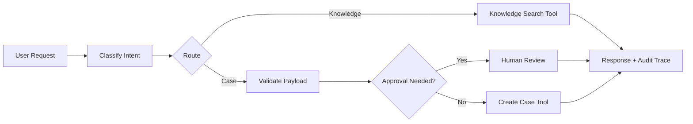

# Agentic AI LangGraph Workflows

Portfolio-grade Agentic AI project demonstrating graph-style workflow
orchestration for enterprise automation.

The implementation is dependency-light and includes a local graph runner that
mirrors LangGraph concepts: state, nodes, conditional routing, tool execution,
human approval gates, and audit traces. It is designed so LangGraph can be added
later without changing the core workflow design.

## Business Problem

Enterprise AI agents need more than a single prompt. They need controlled tool
access, stateful workflows, review gates, retry paths, and auditable decisions.
This repository demonstrates those production patterns in a clean Python codebase.

## Architecture Decisions and Tradeoffs

- **Decision:** Use graph-based orchestration for planner, research, retrieval,
  validation, execution, and approval nodes.
- **Tradeoff:** A graph adds design overhead compared with a single agent loop,
  but it makes state, approvals, retries, and audit events explicit.
- **Expected scale:** Designed as a reference pattern for queue-backed enterprise
  workflows where requests may pause for human approval or retry external tools.
- **Cost strategy:** Track cost units per node, use smaller models for routing,
  and reserve premium LLM calls for complex reasoning or generation steps.
- **Security strategy:** Restrict tools per node, validate state before writes,
  and require human approval for high-risk actions.
- **Operational strategy:** Emit audit events per node, persist checkpoints in
  production, and monitor retry count, review rate, latency, and failure reasons.
- **Lessons learned:** Agentic AI needs workflow engineering and governance as
  much as model integration.

## Architecture



## Tech Stack

- Python 3.10+
- LangGraph `StateGraph` implementation with optional dependency install
- Dependency-light local graph runner for offline demos and tests
- LangChain-ready tool abstraction
- Typed state and audit events
- Pytest-compatible tests

## Quick Start

```bash
python -m src.demo
python -m unittest discover -s tests
docker compose up --build
```

## Included POC Code

- Local graph runner with typed `AgentState`
- Optional LangGraph workflow in `src/langgraph_workflow.py`
- Planner, research, retrieval, validator, execution, and human approval nodes
- Intent classification, risk scoring, retrieval, approval gates, and case creation
- Sample requests in `examples/requests.json`
- Unit tests covering knowledge search, human review, and successful case creation

## Engineering Maturity

- Dockerfile and `docker-compose.yml` for local execution
- GitHub Actions workflow for unit tests
- `.env.example` for safe configuration hygiene
- Architecture overview in `docs/architecture.md`
- Production readiness notes in `docs/production-readiness.md`
- Security and governance guidance in `docs/security-and-governance.md`
- Production readiness notes in `docs/production-readiness.md`
- Security, monitoring, cost, retry, and scalability considerations documented

## Run With LangGraph

```bash
pip install -e .[agentic]
python -c "from src.langgraph_workflow import run_langgraph_demo; print(run_langgraph_demo('create policy-backed support case'))"
```

## What This Demonstrates

- Agentic AI workflow design
- Multi-step routing and tool invocation
- Human-in-the-loop approval gates
- Retry/cost/audit state fields for production agent governance
- Production-safe audit trace generation
- Clean code structure for extending into LangGraph/LangChain

## Production Extensions

- Add LangChain tools for CRM, HRIS, or ticketing systems
- Add Azure OpenAI function/tool calling
- Add durable state storage and async queue processing
- Persist state checkpoints in PostgreSQL or Redis
- Add OpenTelemetry spans for each agent node
