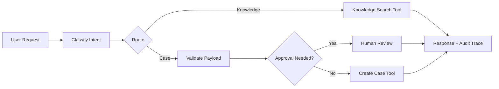

# Agentic AI LangGraph Workflows

Portfolio-grade Agentic AI project demonstrating graph-style workflow
orchestration for enterprise automation.

The implementation is dependency-light and includes a local graph runner that
mirrors LangGraph concepts: state, nodes, conditional routing, tool execution,
human approval gates, and audit traces. It is designed so LangGraph can be added
later without changing the core workflow design.

## Business Problem

Enterprise AI agents need more than a single prompt. They need controlled tool
access, stateful workflows, review gates, retry paths, and auditable decisions.
This repository demonstrates those production patterns in a clean Python codebase.

## Architecture



## Tech Stack

- Python 3.10+
- LangGraph-style orchestration pattern
- LangChain-ready tool abstraction
- Typed state and audit events
- Pytest-compatible tests

## Quick Start

```bash
python -m src.demo
python -m unittest discover -s tests
```

## Included POC Code

- Local graph runner with typed `AgentState`
- Intent classification, risk scoring, retrieval, approval gates, and case creation
- Sample requests in `examples/requests.json`
- Unit tests covering knowledge search, human review, and successful case creation

## What This Demonstrates

- Agentic AI workflow design
- Multi-step routing and tool invocation
- Human-in-the-loop approval gates
- Production-safe audit trace generation
- Clean code structure for extending into LangGraph/LangChain

## Production Extensions

- Replace local graph runner with LangGraph `StateGraph`
- Add LangChain tools for CRM, HRIS, or ticketing systems
- Add Azure OpenAI function/tool calling
- Add durable state storage and async queue processing
