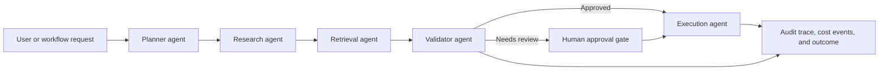

# Architecture Overview

This repository demonstrates an interview-safe Agentic AI workflow using LangGraph-style state transitions and deterministic demo tools. It is a portfolio implementation, not client source code.

## Components

- Planner agent: decomposes the request into safe, scoped steps.
- Research agent: gathers relevant context from configured sources.
- Retrieval agent: finds supporting evidence and citations.
- Validator agent: checks grounding, risk, missing information, and confidence.
- Execution agent: produces the final action plan or sanitized workflow output.

## State Model

The workflow carries request metadata, intermediate evidence, tool results, risk flags, approval status, and audit events. State is explicit so each step can be tested, replayed, and reviewed.

## Production Extension Points

- Persist state in Redis, Postgres, or a workflow store.
- Replace local tools with controlled enterprise tools behind RBAC.
- Add OpenTelemetry spans for each agent and tool call.
- Add policy checks before execution steps that affect external systems.
